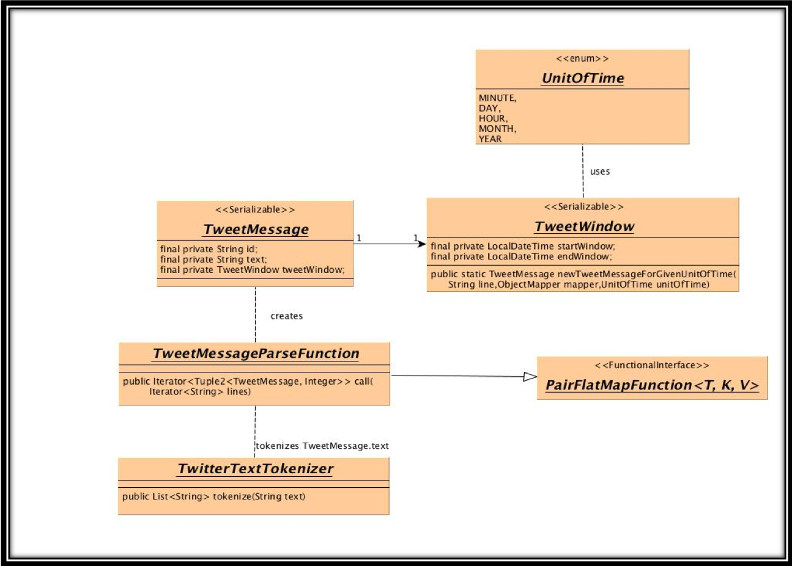
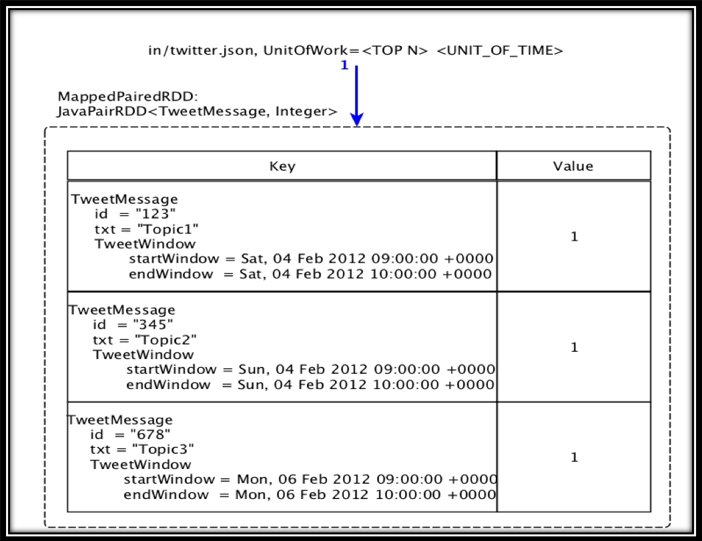
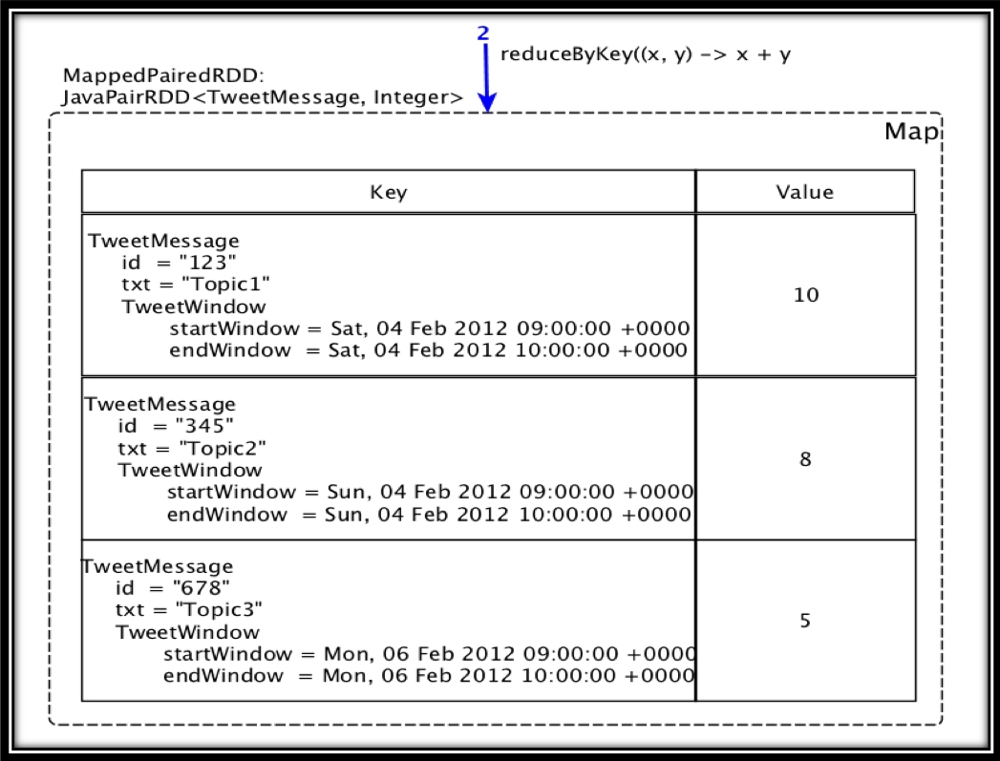
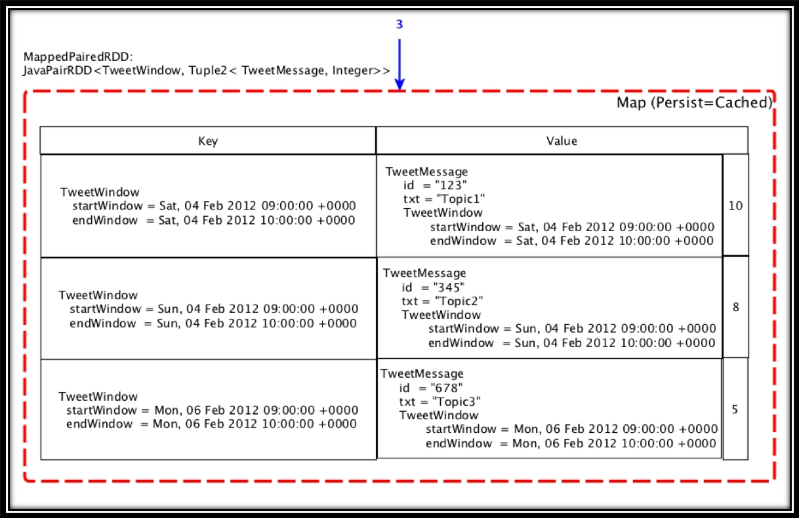
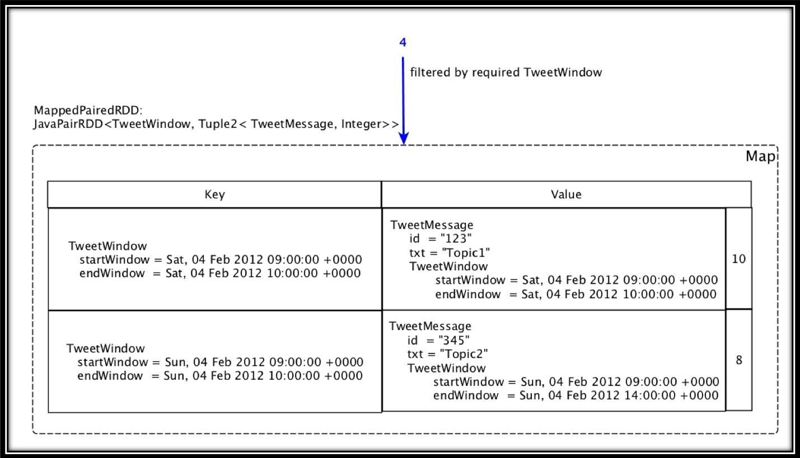
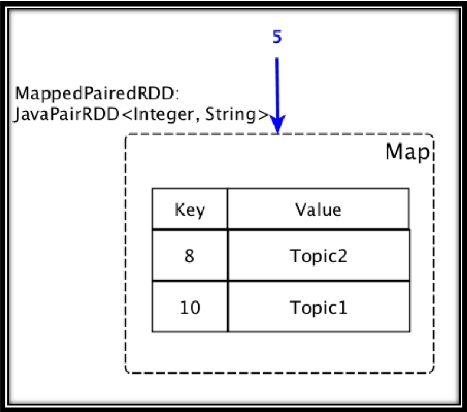
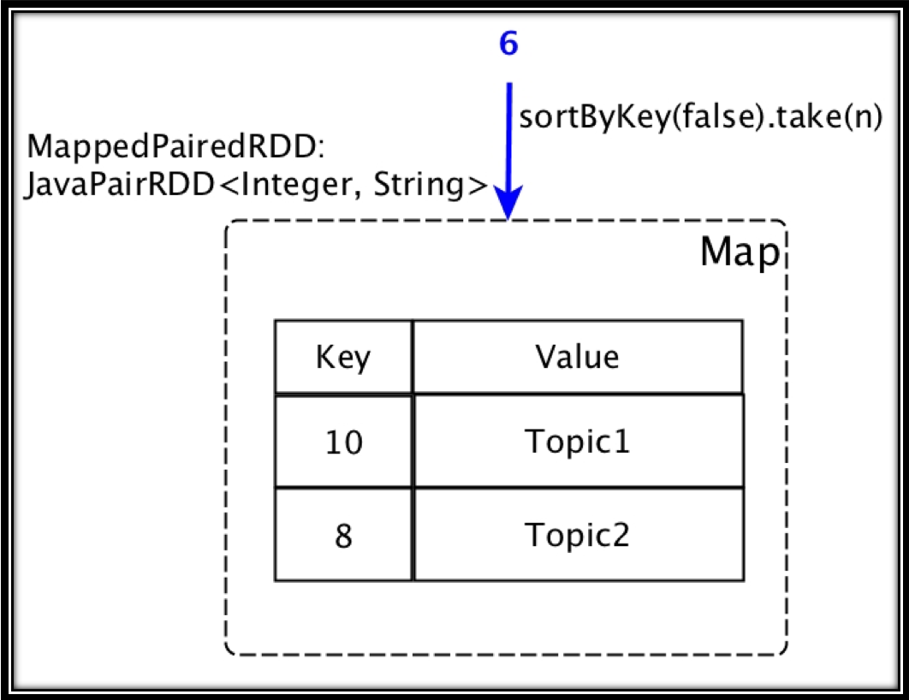
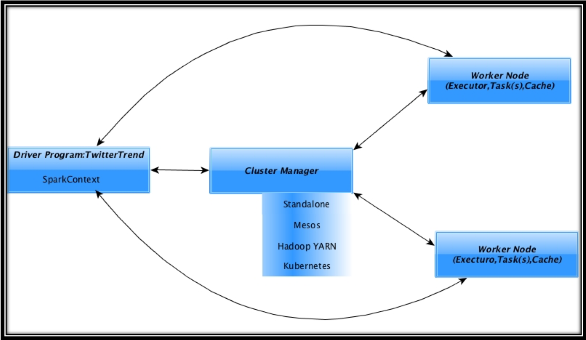

# Twitter Trend

 The Twitter Trending is updated in real-time or near real-time. This application aims at determining trending topics in
 batch based on a available dataset, which was captured over a period of time. This application will produce a top N of 
 trending topics per day/minute/hour/month/year.

#### Instructions to run:

1. Its a gradle based project. To build the project and downloads its dependencies, use following command:
   ./gradlew
2. Import the project into IDE of choice (IntelliJ, Eclipse etc)
3. The project is self contained. The in folder contains:
    a) The small dataset file - twitter.json
    b) The file containing ignore words - IgnoreWords.txt
4. The driver program - TwitterTrend takes following arguments:
   a) TOP N
   b) Unit of Time (DAY|MINUTE|HOUR|MONTH|YEAR)
   c) The name of file to be present in the "in" folder. If no name is given, program will try to load twitter.jsons
5. To run large set on spark, please follow the following steps:
   a) Make a jar using command:
      ./gradlew jar
      This will produce a jar by the name TwitterTrend.jar in folder build/lib
   b) Copy TwitterTrend.jar to apache spark distribution folder
   c) Make a directory "in" and copy large dataset & IgnoreWords.txt files
   d) Run large data use using command:
      ./spark-2.3.0-bin-hadoop2.7/bin/spark-submit --executor-memory 4G TwitterTrend.jar [TOP N] [UNIT OF TIME] [NAME OF THE DATASET]

#### TwitterTrend Technology Stack
    1. Java 1.8.0_91
    2. Gradle 4.6
    3. Apache Spark 2.3.0
    4. Lombok 1.16.18
    5. Junit 4.12
    
    
#### Domain Model

#### Algorithm

1. From twitter JSON file create paired RDD using TweetMessageParseFunction

   
   
2. Reduce by TweetMessage vs count

    

3. Transform to cached paired RDD of TweetWindow Vs Tuple of TweetMessage & count

   
   
4. Filter TweetMessage by required TweetWindow

   
   
5. Transform to count vs TweetMessage.text
    
   
   
6. Sort by key (count) & take n elements

   
   

#### Deployment Architecture

   The following picture shows running to TwitterTrend using Cluster Manager

   
